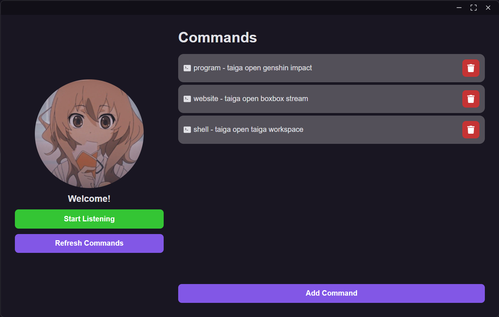

<p align="center">
	 <br>
  🐯 Taiga - A short and cute shortcut app
</p>

<p align="center">
  
  
  
  
  
</p>



## 🐯 Taiga - A short and cute shortcut app

<p align="center">
	
</p>

Taiga is a speech recognition app that executes registered voice commands.

## 📂 Boilerplate

* [diego3g](https://github.com/diego3g)/[electron-typescript-react](https://github.com/diego3g/electron-typescript-react)
  * Website: https://iamtheluiz.github.io
  * Github: [@iamtheluiz](https://github.com/iamtheluiz)
  * LinkedIn: [Luiz Gustavo da Silva Vasconcellos](https://www.linkedin.com/in/luiz-gustavo-da-silva-vasconcellos)

## 🏃 Getting Started

First, clone this repository and access the created folder:

```bash
# Cloning repository
git clone https://github.com/iamtheluiz/taiga.git

cd taiga/
```

Taiga uses electron with react to create a user interface and .NET to recognize user commands.

### Electron

Use a package manager of your choice (npm, yarn, etc.) in order to install all dependencies

```bash
# Project root
cd taiga/

# Install dependencies
yarn
```

### Taiga Recognition

Inside project root we can find 'TaigaRecognition/' folder, containing the voice recognition application created with C#. To build it we need Visual Studio and ".NET desktop development" workload.

```bash
# Recognition Project
cd taiga/TaigaRecognition

# Publish release
dotnet publish -c Release
```

## 👨🏽‍💻 Usage

Just run `start` script.

```bash
yarn start
```

## ⚙️ Packaging

To generate the project package based on the OS you're running on, just run:

```bash
yarn package
```

## 💼 Authors

* **Luiz Gustavo** - *Development* - [iamtheluiz](https://github.com/iamtheluiz)
  * Website: https://iamtheluiz.github.io
  * Github: [@iamtheluiz](https://github.com/iamtheluiz)
  * LinkedIn: [Luiz Gustavo da Silva Vasconcellos](https://www.linkedin.com/in/luiz-gustavo-da-silva-vasconcellos)
